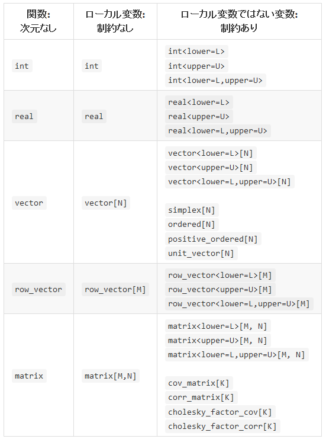

## 19. ユーザー定義関数
この章ではユーザーの視点から例を交えてユーザー定義関数を説明します。厳密な仕様は28章を見てください。ユーザー定義関数を使うと、計算をカプセル化して一つの名前をつけることができ、その名前を使ってどこでも呼び出すことができます。同様に、関数を使うと、複雑な手続きをより理解しやすい構成要素に分解することができます。適切な名前をつけた関数を使用したモジュール性の高いコードは、大きな一枚岩のプログラムよりも理解しやすいです。たとえ一枚岩のプログラムにコメントを多くつけたとしてもです。^[コメントの主な問題は誤解を招く恐れがあることです。それはプログラマー側の誤解によるかもしれませんし、コメントがかかれたあとにプログラムの振る舞いが変えられたためかもしれません。プログラムは常にコードに書かれたように振る舞います。そのため、複雑なコードをリファクタリングして理解しやすい部品にすることは単にコメントを加えることよりも好ましいのです。]

### 19.1. 基本的な関数
ここではユーザー定義関数のStanプログラムの例を扱います。その関数は`generated quantities`ブロックで呼び出され、2つのパラメータの相対差を計算します。
```
functions {
  real relative_diff(real x, real y) {
    real abs_diff;
    real avg_scale;
    abs_diff = fabs(x - y);
    avg_scale = (fabs(x) + fabs(y)) / 2;
    return abs_diff / avg_scale;
  }
}
...
generated quantities {
  real rdiff;
  rdiff = relative_diff(alpha, beta);
}
```
関数名は`relative_diff`とし、2つの`real`型の値を引数にとり、1つの`real`型の値を結果として返すように宣言しています。この関数はビルトイン関数を`generated quantities`ブロックで使うのとまったく同じように使われています。

####　`user-defined functions`ブロック
すべての関数は固有のブロックで定義されます。そのブロックには`functions`というラベルがつけられ、他のどのブロックよりも前に現れなくてはなりません。ただし、`user-defined functions`ブロックはなくても構いません。

#### 関数の本体
本体（波括弧`{ }`の間の部分）には、ローカル変数を含む通常のStanコードが入ります。

#### `return`文
`return`文は関数定義の本体でのみ使うことができます。上の`relative_diff`の例では関数定義の最後の行にあります。`return`文は関数の中のどこに現れても構いません。しかし、`void`ではない値を返す関数は、必ず`return`文で終わる必要があります。これがどのように実行されるかについての詳細は28.7節を見てください。

#### `reject`文
Stanの`reject`文は、プログラムの実行中に遭遇したエラーや問題のある値を報告するための仕組みを提供します。`reject`文では、引用符のついた文字列またはStanの式を任意の数だけ引数にとることができます。この文は、何らかの処理で妥当でない結果が出たことを検出するために、典型的には条件文の中で使われます。

この文の使い方を説明するために、19.1節のユーザー定義の相対差関数の例を修正します。もし相対差が何らかの閾値よりも小さい場合に棄却するようにします。
```
functions {
  real relative_diff(real x, real y, real min) {
    real abs_diff;
    real avg_scale;
    abs_diff = fabs(x - y);
    avg_scale = (fabs(x) + fabs(y)) / 2;
    if (abs_diff / avg_scale < min)
      reject("relative_diff below ", min);
    return abs_diff / avg_scale;
  }
}
```
棄却の効果は関数が呼び出されたブロックに依存します。詳しくは27.9節を見てください。

#### 関数のための型の宣言
関数の引数と返値の型の宣言に、変数のサイズは書きません。また、値の制約も含みません。図19.1に一覧にしましたので見てください。


+---------------+---------------+--------------------+
| 関数:\         | Price         | Advantages         |
| 次元なし        | Price         | Advantages         |
+===============+===============+====================+
| Bananas       | first line\   | first line\        |
|               | next line     | next line          |
+---------------+---------------+--------------------+
| Bananas       | first line\   | first line\        |
|               | next line     | next line          |
+---------------+---------------+--------------------+

<!--
関数:<br>次元なし |  ローカル変数:<br>制約なし | ローカル変数ではない変数:<br>制約あり
---------------- | ------------ | --------
`int` | `int` | `int<lower=L>`<br>`int<upper=U>`<br>`int<lower=L,upper=U>`
`real` | `real` | `real<lower=L>`<br>`real<upper=U>`<br>`real<lower=L,upper=U>`
`vector` | `vector[N]` | `vector<lower=L>[N]`<br>`vector<upper=U>[N]`<br>`vector<lower=L,upper=U>[N]`<br><br>`simplex[N]`<br>`ordered[N]`<br>`positive_ordered[N]`<br>`unit_vector[N]`
`row_vector` | `row_vector[M]` | `row_vector<lower=L>[M]`<br>`row_vector<upper=U>[M]`<br>`row_vector<lower=L,upper=U>[M]`
`matrix` | `matrix[M,N]` | `matrix<lower=L>[M, N]`<br>`matrix<upper=U>[M, N]`<br>`matrix<lower=L,upper=U>[M, N]`<br><br>`cov_matrix[K]`<br>`corr_matrix[K]`<br>`cholesky_factor_cov[K]`<br>`cholesky_factor_corr[K]`<br>
-->

図19.1: 一番左の列は制約のない、次元のない基本の型です。これらは関数の返値の型や引数の型に使われます。中央の列は次元つきの制約のない型です。これらはローカル変数として使われます。一番右の列は左と中央の列に対応する制約のある型です。右側のどの型の式でも、それに対応する左側の型に代入できます。実行時にすべての変数について次元が一貫しているかチェックされます。そして、どんなサイズのコンテナも関数の引数に代入できます。制約のある`matrix`型である`cov_matrix[K]`、`cholesky_factor_cov[K]`、`cholesky_factor_corr[K]`は`matrix[K, K]`という次元を持つ`matrix`に対してだけ代入できます。Stanではこれらの型の任意の配列も使うことができます。ただし、関数の引数や返値の型や変数の宣言は少し変わります。

変数の型宣言と異なり、関数の型宣言においては`matrix`型と`vector`型のサイズは宣言されません。ローカル変数の宣言と同じで、関数の引数の型は制約をつけて宣言することはできません（下限上限の制約も、単体や相関行列のような構造を持つ制約もつけることはできません）。

例えば、単体のパラメータ`theta`を使ってカテゴリカル分布のエントロピーを計算する関数は以下になります。
```
real entropy(vector theta) {
  return sum(theta .* log(theta));
}
```
`theta`は単体でなければなりませんが、型は`vector`が使われています。^[さまざまなビルトインのバリデーション方法はもうすぐStanにも実装されます！現状では代わりに、単体の制約をチェックするために`reject`文を使うことができるでしょう。]関数の宣言において返値の型や引数の型に上下限や制約のある型を使うことは許されていません。


#### 関数の宣言における配列の型
引数としての配列は独自の構文を持っており、その構文はこのマニュアルにおいても関数を区別するために使われています。例えば、2次元配列に作用して1次元配列を生成する関数は以下のように宣言されるでしょう。
```
real[] baz(real[,] x);
```
1次元配列（上のコードの返値）には`[ ]`という記法が使われており、2次元配列には`[ , ]`という記法が使われています。3次元配列には`[ , , ]`という記法が使われ、4次元配列以降も同様です。

関数は`matrix`型と`vector`型を含む任意の型の配列をサポートしています。他の型と同様に、制約をつけることはできません。


### 19.2. ステートメント（文）としての関数
場合によっては、値を返さない関数にするのが理にかなっています。例えば、行列の下三角成分を表示する処理は以下のように定義されるでしょう。
```
functions {
  void pretty_print_tri_lower(matrix x) {
    if (rows(x) == 0) {
      print("empty matrix");
      return;
    }
    print("rows=", rows(x), " cols=", cols(x));
    for (m in 1:rows(x))
      for (n in 1:m)
        print("[", m, ",", n, "]=", x[m, n]);
  }
}
```
特別な語である`void`が返値の型として使われています。`void`は型そのものではなく空の型で値がないこと、すなわち単に値が欠けていることを表しています。そのため、`void`の関数において、`return`文は引数をとることはできません。上のコード例における`return`文のようになります。

適切な型の引数をとった`void`の関数は、それだけで文として使われます。例えば、上で定義した`pretty-print`関数を`transformed parameters`ブロックで定義された分散共分散行列に適用すると以下になります。
```
transformed parameters {
  cov_matrix[K] Sigma;
  ... Sigmaを設定するコード ...
  pretty_print_tri_lower(Sigma);
  ...
```

## 19.3. 対数確率を累積する機能にアクセスする関数
`_lp`で名前が終わる関数の中では、サンプリング文と`target += `文を使うことができます。他の関数名では使うことはできません。このアクセスのため、`_lp`で名前が終わる関数は`transformed parameters`ブロックと`model`ブロックの中でしか使うことができません。

係数のベクトルの事前分布に標準正規分布を設定し、位置（分布の中央）とスケールの事前分布も設定し、平行移動してスケーリングした係数を返す関数の例は以下になります。中央化に関するさらなる情報は22.2節を見てください。

```
functions {
  vector center_lp(vector beta_raw, real mu, real sigma) {
    beta_raw ~ normal(0, 1);
    sigma ~ cauchy(0, 5);
    mu ~ cauchy(0, 2.5);
    return sigma * beta_raw + mu;
  }
  ...
}
parameters {
  vector[K] beta_raw;
  real mu_beta;
  real<lower=0> sigma_beta;
  ...

transformed parameters {
  vector[K] beta;
  ...
  beta = center_lp(beta_raw, mu_beta, sigma_beta);
  ...
```

## 19.4. 乱数生成器として振る舞う関数
`_rng`で終わる名前をつけることで、（疑似）乱数生成器（pseudo random number generator、略してPRNG）として振る舞うようにユーザー定義関数を宣言することができます。`_rng`で終わる名前をつけると、その関数の中ではすべてのPRNG関数を含むビルトイン関数にアクセスでき、`_rng`で終わるユーザー定義関数にアクセスすることができます。`_rng`で名前が終わる関数だけが、その中でビルトインのPRNG関数にアクセスすることができます。そのため、`_rng`で名前が終わる関数は、他のPRNG関数と同様に`generated quantities`ブロックの中でしか使うことができません。

例えば、以下の関数は$(N \times K)$のデータの行列を生成します。その行列の1番目の列は切片として`1`で埋められ、残りの要素は標準正規分布に従う疑似乱数発生器（PRNG）から抽出されます。
```
matrix predictors_rng(int N, int K) {
  matrix[N, K] x;
  for (n in 1:N) {
    x[n,1] = 1.0; // 切片
    for (k in 2:K)
      x[n, k] = normal_rng(0,1);
  }
  return x;
}
```
以下の関数は重回帰のモデルにおいて、データの行列`x`、回帰係数`beta`、ノイズのスケール`sigma`が与えられた場合の結果をシミュレーションしています。
```
vector regression_rng(vector beta, matrix x, real sigma) {
  vector[rows(x)] y;
  vector[rows(x)] mu;
  mu = x * beta;
  for (n in 1:rows(x))
    y[n] = normal_rng(mu[n], sigma);
  return y;
}
```
以下のようにあてはめた回帰モデルを使ってシミュレーションデータを生成するのに、`generated quantity`ブロックでこれらの関数が使われるでしょう。
```
parameters {
  vector[K] beta;
  real<lower=0> sigma;
  ...
generated quantities {
  matrix[N_sim, K] x_sim;
  vector[N_sim] y_sim;
  x_sim = predictors_rng(N_sim, K);
  y_sim = regression_rng(beta, x_sim, sigma);
}
```
より洗練されたシミュレーションでは、予測変数`x`に多変量正規分布をあてはめて、推定されたパラメータを使ってシミュレーションのための予測変数`x_sim`をその多変量正規分布から抽出するかもしれません。


## 19.5. ユーザー定義の確率分布関数
Stanでは確率分布関数を区別するために、確率密度関数の名前は`_lpdf`で終わり、確率質量関数の名前は`_lpmf`で終わります。どちらの関数も`real`型を返します。

標準正規分布を複数使うモデルを考えましょう。Stanでは標準正規分布のために、特定の多重定義された密度関数もデフォルトの確率分布関数も存在しません。そのため、標準正規分布の部分をすべて平均0・スケール1の正規分布で書くよりも、新しい密度関数を定義して再利用した方がいいでしょう。
```
functions {
  real unit_normal_lpdf(real y) {
    return normal_lpdf(y | 0, 1);
  }
}
...
model {
  alpha ~ unit_normal();
  beta ~ unit_normal();
  ...
}
```
`unit_normal`関数を密度関数として使うには、関数名が`_lpdf`で終わる必要があります（同様に質量関数として使うには`_lpmf`で終わる必要があります）。

一般に、もし`foo_lpdf`が$(N + 1)$個の引数をとるように定義されているならば、以下のように使われます。
```
y ~ foo(theta1, ..., thetaN);
```
これは以下を略した書き方です。
```
target += foo_lpdf(y | theta1, ..., thetaN);
```
ビルトイン関数と同じようにサンプリング文においては、末尾の`_lpdf`は落ちて、1番目の引数はサンプリングの記号（`~`）の左側に移動します。

（確率質量関数を表す）`_lpmf`で終わる関数はまったく同じように振る舞います。違いは、密度関数（`_lpdf`）の1番目の引数は連続値でなければならない（整数値または整数値の配列ではない）のに対し、質量関数（`_lpmf`）の1番目の引数は離散値でなければならない（整数値または整数値の配列である）ことです。


## 19.6. 多重定義の関数
Stanではユーザー定義関数の多重定義は許されていません。同じ関数名で引数の型が異なる、2つの別の関数を定義することはできないということです。


## 19.7. 関数にドキュメントをつける
理想はインターフェースのレベルで、関数にドキュメントをつけることでしょう。関数の説明文のためのStanのスタイルガイドは、Doxygen（C++）とJavadoc（Java）の自動文書化システムで使われているのと同じフォーマットに従います。これらのフォーマットでは、何らかの説明文からはじまり、それから引数の変数とそれらの型および返値を表示します。

例えば、19.4節で扱ったデータの行列を生成する関数のドキュメントは以下のようになるでしょう。
```
/**
* データの行列を返す。行はアイテムに対応する。また1番目の列は切片を表す1で埋まり、
* 残りの列は標準正規分布から抽出された乱数で埋まっている。
*
* @param N は行数で、データのアイテムに対応する。
* @param K はアイテムあたりの切片項込みの予測変数の数。
* @return シミュレーションで生成された予測変数の行列。
*/
matrix predictors_rng(int N, int K) {
  ...
```
コメントは`/**`で始まって`*/`で終わります。そしてコメントの各行にアスタリスク（`*`）があります。`@param`のあとに引数の変数名が続き、関数の引数を説明します。`@return`は返値を表します。Stanは（まだ）JavadocやDoxygenのような自動文書生成システムを持っていないので、Stanのパーサにとってはこのコメントは単に`/*`から始まって`*/`で終わる大きなコメントに見えます。

例外を発生させる関数については、`@throws`を使って例外の説明をしましょう。^[Stan 2.10.0現在、ユーザー定義関数で例外を発生させる唯一の方法は、関数が呼ばれる際に（サンプリング文で呼ばれる場合も含む）`reject`文を使って例外を発生させることです。]例えば、
```
...
* @param theta
* @throws もしthetaの要素が1つでも負なら例外を発生します。
*/
real entropy(vector theta) {
  ...
```
たいてい例外のタイプもドキュメントにしますが、Stanの言語の一部として用意されていないので、書く必要はありません。


## 19.8. 関数の型の要約
関数は`void`型または`void`ではない返値の型を持ちます。特別な接尾語である`_lpdf`・`_lpmf`・`_lp`・`_rng`のうちの1つが関数名の末尾につくかもしれません。

### `void` vs. `void`ではない返値
`void`を返すように宣言された関数だけがステートメント（文）として使われます。また、このような関数の内部では引数なしの`return`文が使われます。

`void`でない値を返すように宣言された関数だけが式として使われます。また、このような関数の内部では引数ありの`return`文が使われ、その引数は宣言した返値の型とマッチする必要があります。

### 接尾語がつく または つかない
名前が`_lpmf`または`_lpdf`で終わり、`real`型を返す関数だけが、サンプリング文で確率分布関数として使うことができます。

名前が`_lp`で終わる関数だけが、サンプリング文や`target += `文を通して対数確率を累積する機能にアクセスすることができます。このような関数は`transformed parameters`ブロックまたは`model`ブロックだけで使うことができます。

名前が`_rng`で終わる関数だけがビルトインの疑似乱数発生器にアクセスすることができます。このような関数は`generated quantities`ブロックだけで使うことができます。


## 19.9. 再帰関数
Stanは再帰関数の定義をサポートしています。再帰関数は場合によっては有用です。例えば、行列の累乗$(A^n)$を考えましょう。$(A^n)$は正方行列$(A)$と正の整数値$(n)$に対して次のように定義されます。



ここで$(I)$は単位行列です。この定義は直接再帰関数の定義に変換できます。
```
matrix matrix_pow(matrix a, int n);

matrix matrix_pow(matrix a, int n) {
  if (n == 0)
    return diag_matrix(rep_vector(1, rows(a)));
  else
    return a * matrix_pow(a, n - 1);
}
```
再帰関数の中の`matrix_pow`が明確に定義されているように、関数の定義の前に宣言だけ必要になります。^[Stanの将来のバージョンでは前もって宣言しなくても動くようになるでしょう。]次の条件節を加えることで、ベースケースまでとことん行かないようになり、より効率的になるでしょう。

```
else if (n == 1)
  return a;
```
