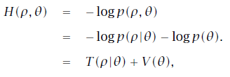
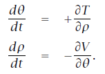
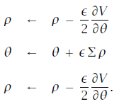

##58. ハミルトニアンモンテカルロサンプリング

ここではStanで実装されているアルゴリズムの実装の詳細とそれをどのように設定するかを説明します。この章ではハミルトニアンモンテカルロ(Hamiltonian Monte Carlo, HMC)アルゴリズムとその適応的な変種であるno-U-turn sampler(NUTS)をStanでの実装と構成に基づいて説明します。次の2つの章ではStanのオプティマイザとdiagnostics(診断の方法)について説明します。

###  58.1 ハミルトニアンモンテカルロ
ハミルトニアンモンテカルロ(HMC)とは事後分布間の効率的な遷移を生成するためのサンプリングとして密度関数の導関数を使うようなマルコフ連鎖モンテカルロ法(Markov chain Monte Carlo, MCMC)です(より詳細はBetancourt and Girolami, 2013; Neal, 2011)。

この手法はメトロポリス法の受理ステップを行うことで補正された数値積分に基づいて近似されたハミルトン力学系のシミュレーションを用いています。
このセクションはBetancourt and Girolami (2013)によるHMCのプレゼンテーションをGelman et al. (2013)の記法に直したものです。

####目標とする密度関数
サンプリングの最終目的はパラメータθに対する密度p(θ)から値を抽出することです。これは典型的には与えられたデータyに対するベイズ事後分布p(θ|y)、特にStanプログラムで書かれたベイズ事後分布になります。

####補助運動量変数
HMCでは補助運動量変数ρが導入され、結合密度

から値が抽出されます。Stanを含むHMCのほとんどの応用では補助分布としてはパラメータθに依存しない多変量正規分布

を用います。共分散行列Σは目標とする分布の回転とスケール変換のためのユークリッド計量として振舞います(幾何学の詳細についてはBetancourt and Stein, 2011を参照)。Stanではこの行列はidentity matrix(単位行列)またはwarmup期間のサンプルから推測され、制限された対角行列になります。逆行列$$ Σ{-} $$は質量行列(mass matrix)という名前で知られ、Σが単位、対角、密行列のいずれかであればそれと同じ性質を持ちます。

####ハミルトニアン
結合密度p(ρ,θ)はハミルトニアン

で定義され、項T

は"運動エネルギー",項V

は"ポテンシャルエネルギー"と呼ばれます。このポテンシャルエネルギーはStanでは対数密度の定義から求まります。

####遷移の生成
パラメータθの現在の値から新しい状態への遷移はメトロポリス法の受理ステップとその前の2つの手順で生成されます。

最初に運動量の値が現在のパラメータの値とは独立に分布

から抽出されます。運動量はiterationのたびに新しい値になり以前の値に影響されません。

次に現在のパラメータの値θと新しい運動量ρを結合した系(θ, ρ)をハミルトン方程式

にしたがって発展させます。
運動量密度と目標の密度関数は独立、つまりp(ρ|θ)=p(ρ)なので運動量の時間微分のはじめの項∂T/∂θ=0になります。よって時間微分の式は

となります。
####蛙飛び積分(Leapfrog Integrator)
このセクションの最後に2状態の微分方程式を解く作業が残されています。
Stanは他のほとんどのHMCの実装と同様に蛙飛び積分(Leapfrog Integrator)を使っています。
これはハミルトン方程式の結果を安定させるために調整された数値積分アルゴリズムです。

ほとんどの数値積分と同じ様に蛙飛びアルゴリズムは小さな時間間隔εの離散的なステップごとに行われます。

蛙飛びアルゴリズムは新しい運動量の項をパラメータθとは独立に抽出するか前の運動量の値

から始め、ステップの半分だけの運動量の更新と1ステップ分の位置の更新を交互に行います。

L回の蛙飛びステップでLεだけの時間の動きがシミュレートされます。この結果(上記の3つのステップのL回繰り返し)で得られる状態を(ρ*,θ*)と書きます。

蛙飛び積分の誤差は1ステップあたりの時間間隔(step size)であるεの3乗、大域的にはεの2乗のオーダーになります。
Leimkuhler and Reich(2004)には蛙飛び積分の誤差の範囲の導出を含めたハミルトン系の数値積分の詳細な解析が紹介されています。

####メトロポリス受理ステップ
蛙飛び積分が完全に数値的であれば運動量ベクトルをランダムに生成するのとは別に遷移ごとにランダム化を施す必要はなくなります。しかし実際には積分による数値誤差をメトロポリス受理ステップを適用する際には考慮する必要があります。
(ρ,θ)からの遷移で生成された提案値(ρ*,θ*)が受理される確率は

であり、もし提案分布が受理されなければ前のパラメータの値が次の値としてサンプルされ、次のiterationにも使われます。

####アルゴリズムのまとめ
ハミルトニアンモンテカルロアルゴリズムは初期設定されたパラメータの組θからはじめられます。
Stanではこの値はユーザーが設定することもランダムに生成することも出来ます。
そして指定された数だけ新しい運動量のサンプリングとパラメータθの現在の値が
時間間隔εで離散化された蛙飛び積分がL回実行が繰り替えされることで更新されます。
その後メトロポリス受理ステップが適用され、提案された状態値(ρ*,θ*)が使われるか元の状態値のままにするかが決定されます。

