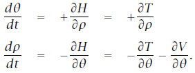

##58. ハミルトニアンモンテカルロサンプリング

ここではStanで実装されているアルゴリズムの実装の詳細とそれをどのように設定するかを説明します。この章ではハミルトニアンモンテカルロ(Hamiltonian Monte Carlo, HMC)アルゴリズムとその適応的な変種であるno-U-turn sampler(NUTS)をStanでの実装と構成に基づいて説明します。次の2つの章ではStanのオプティマイザとdiagnostics(診断の方法)について説明します。

###  58.1 ハミルトニアンモンテカルロ
ハミルトニアンモンテカルロ(HMC)とは事後分布間の効率的な遷移を生成するためのサンプリングとして密度関数の導関数を使うようなマルコフ連鎖モンテカルロ法(Markov chain Monte Carlo, MCMC)です(より詳細はBetancourt and Girolami, 2013; Neal, 2011)。

この手法はメトロポリス法の受理ステップを行うことで補正された数値積分に基づいて近似されたハミルトン力学系のシミュレーションを用いています。
このセクションはBetancourt and Girolami (2013)によるHMCのプレゼンテーションをGelman et al. (2013)の記法に直したものです。

####目標とする密度関数
サンプリングの最終目的はパラメータθに対する密度p(θ)から値を抽出することです。これは典型的には与えられたデータyに対するベイズ事後分布p(θ|y)、特にStanプログラムで書かれたベイズ事後分布になります。

####補助運動量変数
HMCでは補助運動量変数ρが導入され、結合密度


から値が抽出されます。Stanを含むHMCのほとんどの応用では補助分布としてはパラメータθに依存しない多変量正規分布


を用います。共分散行列Σは目標とする分布の回転とスケール変換のためのユークリッド計量として振舞います(幾何学の詳細についてはBetancourt and Stein, 2011を参照)。Stanではこの行列はidentity matrix(単位行列)またはwarmup期間のサンプルから推測され、制限された対角行列になります。逆行列$\Sigma^{-1}$は質量行列(mass matrix)という名前で知られ、$\Sigma$が単位、対角、密行列のいずれかであればそれと同じ性質を持ちます。

####ハミルトニアン
結合密度$p(\rho,\theta)$はハミルトニアン


で定義され、項T


は"運動エネルギー",項V


は"ポテンシャルエネルギー"と呼ばれます。このポテンシャルエネルギーはStanでは対数密度の定義から求まります。

####遷移の生成
パラメータ$\theta$の現在の値から新しい状態への遷移はメトロポリス法の受理ステップとその前の2つの手順で生成されます。

最初に運動量の値が現在のパラメータの値とは独立に分布


から抽出されます。運動量はiterationのたびに新しい値になり以前の値に影響されません。

次に現在のパラメータの値$\theta$と新しい運動量$\rho$を結合した系$(\theta,\rho)$をハミルトン方程式



にしたがって発展させます。
運動量密度と目標の密度関数は独立、つまり$p(\rho|\theta)=p(\rho)$なので運動量の時間微分のはじめの項$\partial T/\partial \theta/=0$になります。よって時間微分の式は


となります。

####蛙飛び積分(Leapfrog Integrator)
このセクションの最後に2状態の微分方程式を解く作業が残されています。
Stanは他のほとんどのHMCの実装と同様に蛙飛び積分(Leapfrog Integrator)を使っています。
これはハミルトン方程式の結果を安定させるために調整された数値積分アルゴリズムです。

ほとんどの数値積分と同じ様に蛙飛びアルゴリズムは小さな時間間隔$\epsilon$の離散的なステップごとに行われます。

蛙飛びアルゴリズムは新しい運動量の項をパラメータ$\theta$とは独立に抽出するか前の運動量の値


から始め、ステップの半分だけの運動量の更新と1ステップ分の位置の更新を交互に行います。


L回の蛙飛びステップで$L\epsilon$だけの時間の動きがシミュレートされます。この結果(上記の3つのステップのL回繰り返し)で得られる状態を$(\rho*,\theta*)$と書きます。

蛙飛び積分の誤差は1ステップあたりの時間間隔(step size)である$\ep$の3乗、大域的には$\ep$の2乗のオーダーになります。
Leimkuhler and Reich(2004)には蛙飛び積分の誤差の範囲の導出を含めたハミルトン系の数値積分の詳細な解析が紹介されています。

####メトロポリス受理ステップ
蛙飛び積分が完全に数値的であれば運動量ベクトルをランダムに生成するのとは別に遷移ごとにランダム化を施す必要はなくなります。しかし実際には積分による数値誤差をメトロポリス受理ステップを適用する際には考慮する必要があります。
$(\rh,\th)$からの遷移で生成された提案値$(\rho*,\theta*)$が受理される確率は


であり、もし提案分布が受理されなければ前のパラメータの値が次の値としてサンプルされ、次のiterationにも使われます。

####アルゴリズムのまとめ
ハミルトニアンモンテカルロアルゴリズムは初期設定されたパラメータの組$th$からはじめられます。
Stanではこの値はユーザーが設定することもランダムに生成することも出来ます。
そして指定された数だけ新しい運動量のサンプリングとパラメータ$th$の現在の値が
時間間隔$\ep$で離散化された蛙飛び積分がL回実行が繰り替えされることで更新されます。
その後メトロポリス受理ステップが適用され、提案された状態値$(\rh*,\th*)$が使われるか元の状態値のままにするかが決定されます。


###  58.2 HMCアルゴリズムのパラメータ
ハミルトンモンテカルロ法は以下の3つのパラメータを設定しなければいけません。

- 時間を離散化する間隔 $\epsilon$
- 質量行列 $ \Sigma^{-1} $
- ステップの数 L

実際、サンプリングの効率、1回のサンプリングとその繰り返しの速度はこの3つのパラメータに大きく依存します(Neal, 2011;Hoffman and Gelman, 2014)。

もし$\ep$が大きすぎれば蛙飛び積分は正確なものではなくなりメトロポリス受理ステップにおける提案の多くが棄却されるでしょう。もし$\ep$が小さすぎれば蛙飛び積分のシミュレーション時間は長くなってしまうでしょう。これらの困難な点をバランスさせるような受理率を決めることが目標になります。

もしLが小さすぎれば1回の繰り返しあたりのハミルトン方程式の積分軌道は短すぎサンプリングはランダムウォークによって移り変わって行ってしまうことでしょう。Lが大きすぎれば1回の繰り返しに対するアルゴリズムの負荷は大きくなってしまいます。

質量行列$\Sigma$が事後分布の共分散に合致していない場合、計算の正確性を確保するためにステップサイズ$\ep$は小さくしなければなりませんし、
一方同時に統計的な効率性を保つために必要なステップ数Lは大きくなければなりません。

####積分時間
実際に積分される時間間隔は$L\ep$でステップ数の関数です。いくつかのStanのインターフェースは積分時間tと離散化の間隔(step size)εの近似値を設定します。そのような場合ステップ数は
$$ L= \frac{t}{\epsilon} $$
と丸められ実際の積分時間は$L\ep$となるでしょう。


図58.1 warmup中の適応は３段階に分けて行われる: 期間(I) 最初の速いステップ, 期間(II) ゆっくりした適応の展開列, 期間(III) 最後の速い適応. HMCでは速い期間、ゆっくりした期間の双方がステップサイズを調整する為に使われていて、ゆっくりした期間は計量に必要な(共)分散の学習の為に使われる。iteration回数は左端が1で図の右に行くに従って増えていく。

####自動パラメータチューニング
Stanはno-U-turn sampling(NUTS)アルゴリズムを使うことで目標とする受理率になるように自動的に$\ep$を最適化すること、
warmupでのサンプリングのiterationに基づいて$\Sigma$を推定すること、サンプリング(とwarmup)中に動的にLを調整することができます(Hoffman and Gelman, 2014)。。

パラメータの適応を行う場合には (step size, 質量行列を調整することで適応をoffにすることもできます)warmupは図58.1のように3つの期間(interval)、1つのゆっくりと成長する期間の連なりとそれをそれを挟む2つの速い期間とに分けて行われます。
ここで速い期間、遅い期間とはパラメータの適応に局所的な情報か大域的な情報を使うかの違いです。
ハミルトニアンモンテカルロサンプラーでは、例えばstep sizeを速いパラメータ、(共)分散を遅いパラメータとして定義しています。
最初と最後の速い期間のサイズと最初の遅い期間のサイズはカスタマイズすることができ、ユーザーの設定した値はwarmup期間中にalignmentを満たすために少し変更されることがあります。

warmup期間を分割する動機は適応をより安定したものにすることで、各段階は以下のようになります。

+ 最初の速い間隔ではチェーンは局所的な情報からのみ学習できるパラメータで典型的集合(typical set) に収束することが許されています。
((典型的集合(typical set)は情報理論で使われている概念を借用したものでここでは平衡状態でマルコフ連鎖(Markov chain)が遷移しているような
実体のある事後確率質量の近傍(または多変量モデルにおける近傍)です。
))

+ この大域的情報を必要とする最初の期間のパラメータ、例えば(共)分散、が無記憶性の窓期間の列内で推定されます。たいていは速いパラメータもここで推定されます。
+ 最後に遅いパラメータの最終的な更新の後に速いパラメータの適応が行われます。

これらの期間は以下のような調整パラメータにのっとって制御されます。各パラメータは正の整数である必要があります。

| パラメータ  | 説明                     |デフォルト値 |
|:------------|-------------------------:|:-----------:|
| 初期バッファ| 最初の速い期間の長さ     |     25      |
| 期間バッファ| 最後の速い期間の長さ     |     50      |
| 窓          | 最初の遅い適応期間の長さ |     25      |


####パラメータ適応期間の離散化

StanのHMCアルゴリズムはstep sizeを最適化するのに双平均化法(dual averaging, Nesterov, 2009)を使っています。
このwarmupの手続きはとても柔軟で完全なもので、StanではHoff- man and Gelman (2014)の記法を用いて、オプションとして指定できるようにそのインターフェイスをユーザに提供しています。
実際最適化の有効性はこのパラメータの値に対して敏感に変化します。しかし我々は双平均化法を使った経験があるのではない限りパラメータの値をデフォルト値から動かすことは推奨しません。
より詳細な情報は(Hoffman and Gelman, 2011, 2014)の双平均化法に関する議論を参照して下さい。

双平均法の全てのパラメータを以下に示します。

| パラメータ  | 説明                            | 拘束条件         |デフォルト値 |
|:------------|--------------------------------:|:----------------:|:-----------:|
| $delta$     | 目標とするメトロポリス受理率    | $\delta\in[0,1]$ |   0.80      |
| $\gamma$    | 適応正規化スケール              | $\gamma  > 0$    |   0.05      |
| $\kappa$    | 適応緩和指数                    | $\kappa  > 0$    |   0.75      |
| $t_0$       | 適応のイテレーションのオフセット| $t_0> 0$         |   10        |

目標とする受理率$\delta$(1より小さい値に設定する必要があり、デフォルト値は0.8)を1に近い値に設定することで適応は小さなstep sizeを用いて行われることに成ります。
これはイテレーションの増加のコストに対するサンプリングの効率(イテレーションあたりの有効なサンプリング)を高めます。　
$\delta$の値を上げることでいくつかのモデルではそれ以外の方法では行き詰まってしまうような場合にその行き詰まり(blockage)に打ち勝つことができます。

####step sizeのゆらぎ
数値積分を使った全てのHMCの実装はstep size(時間間隔の離散化)を必要とします。Stanはstep sizeを適応的に決める方法、明示的に決める方法の両方に対応しています。
またStanでは曲率が大きな場合に固定したstep sizeと合わさって悪影響がでるのを避けるためにサンプリングごとランダムなゆらぎ(jitter)を持たせたstep sizeを使うことができます。

ゆらぎの値はもとのstep sizeの値に足される、あるいはもとの値から引かれることになります。それなのでとりうるゆらぎの最大値は1となり、この場合step sizeは0から適応値の2倍までの範囲になります。

小さなstep sizeを設定することでより大きな値ではHMCサンプラーが行き詰まってしまうような場合((訳注：受理率が低い？))にも進むようにできます。
良くない点として値が適応値を下回って揺らいでいる場合必要な蛙飛びのステップ回数が多くなるのでイテレーションを遅くし、
値が適応値を上回って揺らいでいる場合はハミルトン力学系の計算のシミュレーションエラーによる早すぎる棄却を引き起こすということがあります。
step sizeのゆらぎに関するより詳細な議論は(Neal, 2011)を参照してください。

####ユークリッド計量
Stanの中の全てのHMCの実装では質量行列(mass matrix)、より形式的には計量(metric)と呼ばれる対称で正定値の行列の中から選ばれた2次の運動エネルギー関数として使われています。
もし計量が定数であればその実装はユークリッドHMCと呼ばれます。Stanでは以下の3つのユークリッドHMCの実装が使えます。

+単位計量(対角要素が1の対角行列)
+対角計量(対角要素が正の値の対角行列)
+密な計量(密な正定値対称行列)

ユーザーは計量の形を設定することができます。

もし質量行列が対角に設定されていれば、正規化された分散((訳注: 共分散？))は1イテレーションの遅い期間(図58.1のIIの期間)毎に推定され、それぞれの推定値はその期間内のイテレーションによってのみ決まります。
これはwarmupで指針として使われる早い段階での推定に使われますが、後には忘れされるので最終的な共分散の値の推定には影響しません。

もし質量行列が密に設定されれば正規化された共分散の推定が行われ、それ自体は単位行列に正規化されるような対角行列に正規化されます。

分散または共分散は多くの浮動小数点演算の繰り返しによる精度の喪失を避けるためにWelford累積を用いて推定されます。

####warmup回数と質量行列の推定
質量行列は事後分布の線形(ここでは大域的と同義になる)な相関を補正し、いくつかの問題ではHMCのパフォーマンスを劇的に改善します。これには大域的な相関を知る必要があります。

複雑なモデルでは大域的な相関は大抵は難しく、不可能でなければ解析的に導かれます。例えばデータのスケーリングがねじれているような非線形なモデルではデータの正規化(standardizing)は必ずしも助けには成りません。
それゆえStanは適応的なwarmupでオンラインに補正を行います。強い非線形性(ここでは局所性と同義)の相関は正規化を行った場合でさえ学習が遅くなり得ます。
これがStanでなぜwarmupが必要でしばしばそれが長い時間を必要とするかの究極的な理由であり、十分長いwarmupが実質的なパフォーマンスの改善をもたらすことが出来るかの理由でもあります。

#####非線形性

質量行列は事後分布での線形(ここでは大域的または位置に依存しないことと等価)な相関のみを補正します。
階層的なパラメータ一方では階層的なモデルでよく現れるたちの悪い非線形(ここでは局所的または位置に依存したことと等価)な相関しています。
((リーマニアンHMCだけが計量を実現でき、それによって(パラメータ空間での)位置に依存した質量行列、非線形な相関の補正が有効になり始めます。))

密な質量行列の最も大きな問題は質量行列それ自体の推定が卵と鶏のような関係を引き起こすことです。適切な質量行列をサンプリングから推定するには収束する必要があり、それには適切な質量行列が必要になります。

#####質量行列が密か対角か
サンプリングに問題があるような統計モデルは一般には密な行列で調節できるような線形相関だけに支配されている訳ではありません。
むしろもっと複雑な非線形の相関に支配されていてリーマニアンHMC(Riemannian HMC)のようなより高度なアルゴリズムを用いたパラメータの採取するのがよいです。

#####warmup回数と曲率

MCMCの収束にかかる時間は大まかには自己相関時間と同じです。HMC(とNUTS)のチェーンは自己相関が低くなりがちなのでとても速く収束しがちだからです。

これが唯一の適用できる場合は事後分布の幅の中に一様に分布している場合で多くの複雑なモデルではこの仮定は破れています。
実に多くの場合事後分布の質量は良い性質を満たしていて分布の裾はの曲率は大きく、
別の言い方をすればwarmupがゆっくりな理由は分布の裾においてHMCのイテレーションのコストが高いからと言えます。

分布の裾における低性能は数回のwarmupのイテレーションではカバーできないような振る舞いです。
最初の数回のイテレーションの受理確率とstep sizeを見れば、解こうとしている問題がいかに悪い問題であるかといったことや、
事前分布をより問題にあうようタイトに設定するとか、パラメータを再調整するなどのモデリングの努力が必要であるかがわかります。

####NUTSとその調整
no-U-turnサンプラー(NUTS)は各イテレーションでの
不必要に事後分布の中を横切ることなしに値を提案出来るような適切な数の蛙飛びステップを自動的に選択できます。
そのような手法を使う動機としては各ステップでのジャンプ距離の２乗の期待値を最大化すること(例えば(Roberts et al., 1997)を参照)と、
事後分布に相関があるときにメトロポリスサンプラーまたはギブスサンプラーで生じるのランダムウォーク的特性を避けるためというのがあります。
NUTSアルゴリズムの厳密な定義と詳細釣り合いの照明は(Hoffman and Gelman, 2011, 2014)を参照してください。

NUTSはひとつ前のイテレーションで抽出されたパラメータで決められる初期位置から出発して提案値を生成します。
そして独立な単位正規分布に従う運動量ベクトルを生成します。この最初の系は平衡２分木(balanced binary tree)を作るために時間的に前向き、後ろ向きの両方に発展させます。
NUTSアルゴリズムにおけるそれぞれのイテレーションにおいて木の深さは蛙飛びステップの数が倍になる、実効的には計算時間が倍になると１増えます。
アルゴリズムは以下の2つの条件のうち１つを満たすと停止します。

- NUTSの基準(部分木上のユークリッド空間内のU-turn)が新しい部分木または木全体で満たされたとき
- 木全体の深さが定めた最大値に達した時

標準的なメトロポリスステップではなく、最後の発展ステップ(生成されたイテレーションの後半)のスライスサンプリングのパラメータ値が選ばれます。

no-U-turnサンプリングの調整は各イテレーションで評価される木の深さに上限を定めることを伴います。
これは深さの最大値のパラメータによって調節することができます。蛙飛びステップの数は2の深さの最大値-1乗によって抑えられます。

木の深さと実際に計算された蛙飛びステップの数の双方はパラメータと一緒にレポートされ、それぞれ`treedepth__` 、`n_leapfrog__`として出力されます。
最後の部分木は部分的にしか作られていないのでこの2つの値は常に

$$ 2^{treedepth-1} < N_leapfrog < 2^{treedepth}-1 $$

を満たします。木の深さはNUTSの診断ツールとして重要です。例えば木の深さが0というのは最初の蛙飛びステップによる提案値がすぐに拒絶(受理されず)最初の状態に戻ったときにおきます。
これは極端な曲率か(少なくとも現在の状態に対して)不適切なステップサイズが選ばれたときに起こりえます。
一方木の深さが最大値に等しいときはNUTSは多くの蛙飛びステップを行い計算時間が非常に長くなるのを避けるために未熟な状態で停止することを示唆しています。
非常に多くの回数のステップは適応がうまく出来ていないことを示していて、目標とする受理率が非常に高いかあるいは単にサンプルをするには難しい事後分布の形をしているのを示唆していると思われます。
後者の場合パラメータの再設定(reparameterization)が有効でしょう。
しかし稀にモデルが正しく定義されていても多くのステップが必要になり、最大の深さはNUTSの木が必要な大きさだけ成長できるような数まで大きくなるでしょう。

#####パラメータなしでのサンプリング

有効グラフィカルモデル上での純粋に前向きなデータのシミュレーション(あるいはパラメータとデータをシミュレートするための既知の事前分布から生成的に行われるようなもの)のような状況においては
Stanではいかなるパラメータ(`parameters`)も定義する必要がなくなります。`model block`は空になり、全ての出力される量は`generated quantities block`で作られることになります。
例えばK回試行、成功率θの二項分布からのN回抽出を生成するようなプログラムは以下のようになります。
```
data {
      real<lower=0,upper=1> theta;
      int<lower=0> K;
      int<lower=0> N;
    }
    model {
    }
    generated quantities {
      int<lower=0,upper=K> y[N];
      for (n in 1:N)
        y[n] <- binomial_rng(K, theta);
    }
```
全てのStanプログラムは`model block`を持たなければいけないのでこのプログラムは空の`model block`を含みます。このモデルではサンプラーはパラメータがないために固定されたパラメータで調整されなければいけません。
パラメータサンプリングなしでは適応をする必要がなく、warmupのイテレーションもする必要がないのでその回数は0にすべきです。

パラメータなしでのサンプリング用に書かれたほとんどのモデルではパラメータが定義される代わりにパラメータのような振る舞いをする`data block`が置かれます。
それでも固定パラメータサンプリングと通常の方法(ランダム、0固定、または指定した値)による初期化のためにパラメータを含めることは可能です。
例えば上記の例の`theta`はパラメータとして定義、初期化することが出来ます。


